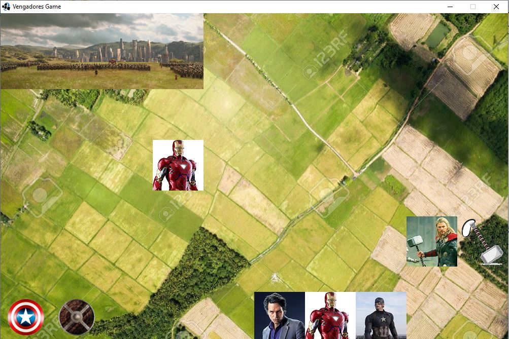

## Vengadores.

Nos sumergimos en el fantástico mundo de Marvel junto con sus héroes, armas, villanos y lugares.

De los héroes conocemos a:

* Capitán américa: de él conocemos el escudo que está empuñando y entre sus actividades encontramos cambiar su escudo actual por uno nuevo, calcular su fuerza (la cual consideramos como el doble del poder del escudo) y reforzarse (cambiar su escudo actual por una cacerola).
* Iron Man: de él conocemos si tiene el traje puesto o no, y entre sus actividades encontramos reforzarse (ponerse su traje) y calcular su fuerza la cual consideramos 100 en caso de que tenga su traje puesto y 50 en caso de que no lo tenga.
* Spider Man: de él sólo conocemos sus actividades las cuales son calcular su fuerza (que consideramos siempre 1) y reforzarse (no hace absolutamente nada)
* Hulk: de él conocemos su fuerza que es inicialmente 20 y entre  sus actividades encontramos transformarse (aumenta su fuerza en 80), calcular su fuerza (su fuerza actual) y reforzarse que en su caso es transformarse.
* Antman: el puede meterse en el mundo cuántico en donde las leyes del espacio-tiempo cambian, entre sus actividades encontramos ir y volver del mundo cuántico, calcular su fuerza (1 si está en el modo cuántico y 50 si no) y reforzarse (ir al mundo cuántico).
* Pantera Negra:  con una fuerza iniciada en 40, Pantera Negra tiene un poder que solo puede usar cuando es elegido rey de wakanda, el cual aumenta su fuerza en  la fuerza total de su ejército. Cuando se refuerza utiliza dicho poder.

Los escudos que puede empuñar el capitán américa son:
* Escudo simple: con un poder de 10, se puede empoderar(modelar a su criterio).
* Escudito: con un poder de 1.
* Cacerola: con un poder de 10 y con la que se puede cocinar y reclamar por la cuarentena.

Del país de Wakanda se sabe que se ha convertido en una superpotencia mundial ya que en ella se encuentran abundantes minas de minerales preciosos que son codiciados por los villanos. 
Wakanda posee un valiente ejército con un poder de 1000,  un héroe, el cual  es considerado Rey y un índice de amenaza de distintos villanos.

Cuando Wakanda es atacada el índice de amenaza aumenta en el potencial de amenaza del villano que la está atacando y su ejército pierde su poder en base a la fuerza de dicho enemigo.
cuando esto sucede pueden suceder dos situaciones: 
En caso de que el país se encuentre en peligro, el héroe pasa a ser el villano y la amenaza aumenta en la fuerza de este.
Caso contrario la amenaza se reduce en la fuerza del villano.
Aclaración: consideramos que el país está en peligro cuando el héroe no es lo suficientemente fuerte como para defender a su país de la amenaza.

De los villanos conocemos su fuerza y su nivel de amenaza, entre ellos encontramos:
Dr Doom: con un nivel de amenaza de 150 y una fuerza igual a ese nivel
Thanos: del cual sabemos si posee alguna de las 5 gemas, y su fuerza es la suma de los poderes de cada gema que posee actualmente // esto para cuando demos colecciones.
Loki: tiene el poder de copiar la apariencia de un héroe y su fuerza.
